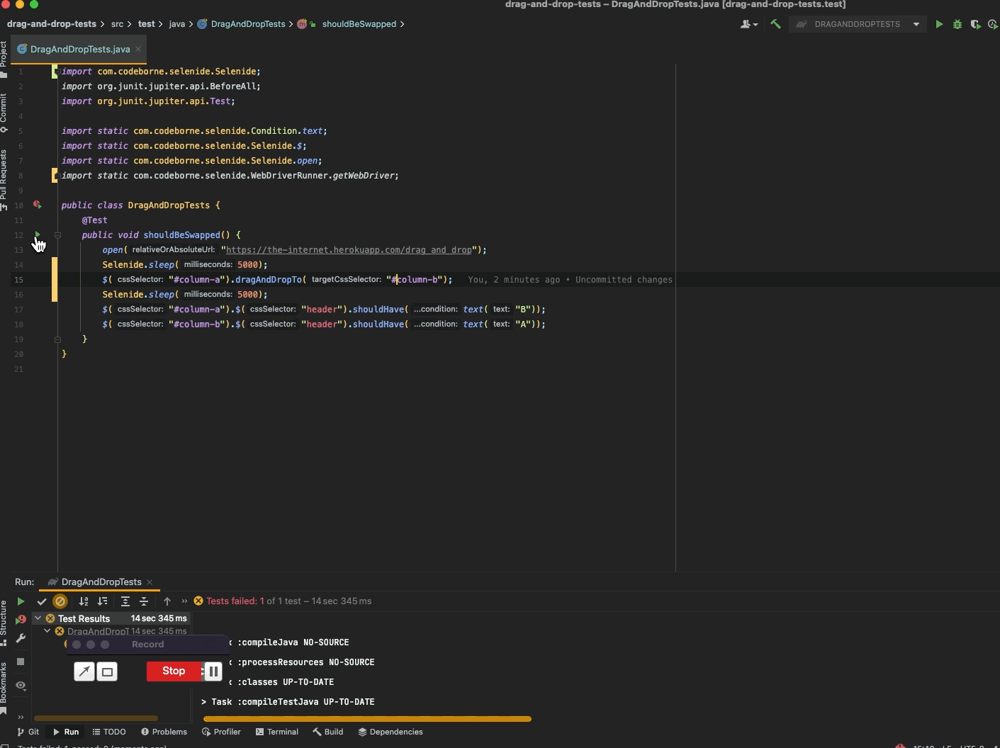

## Homework QA_GURU

### Selenide #1

Drag and drop test for the demo page on the-internet.herokuapp.com.
It drags column A onto column B and checks that the headers swapped places.

```java
@Test
@DisplayName("Columns A and B swap places after drag-and-drop")
void shouldSwapColumns() {
    open(DRAG_AND_DROP_PAGE);

    $(COLUMN_A).dragAndDrop(DragAndDropOptions.to(COLUMN_B));

    $(COLUMN_A).$("header").shouldHave(text("B"));
    $(COLUMN_B).$("header").shouldHave(text("A"));
}
```

Run it:

```bash
./gradlew test
```


